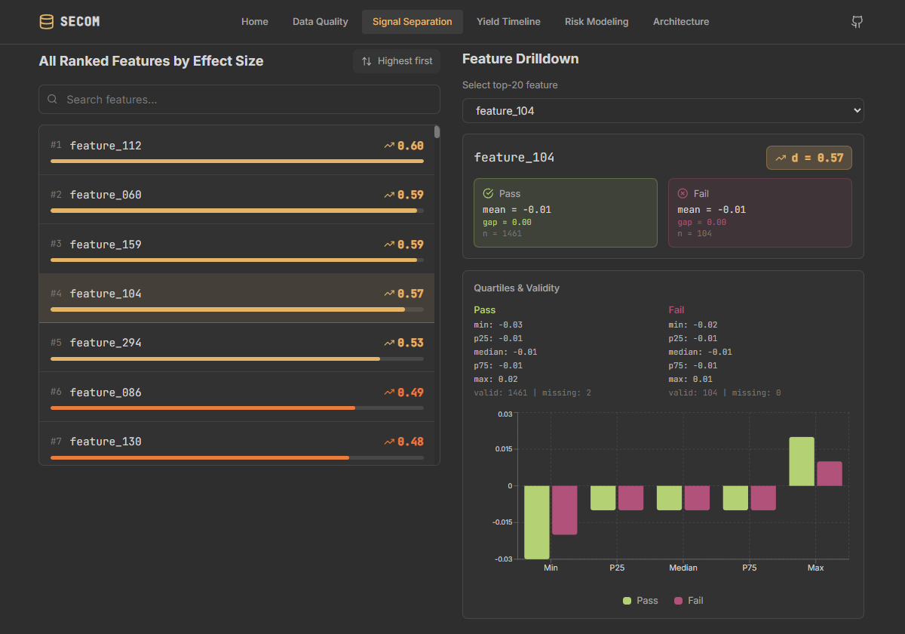

# SECOM Manufacturing Data Quality Platform

A semiconductor manufacturing analytics case study built on the UCI SECOM dataset. It demonstrates a complete data-engineering workflow: PostgreSQL warehouse with raw, staging, and mart layers; data-quality profiling and feature cataloging; rare-event modeling with walk-forward validation; and a multi-page React dashboard.


| Signal Separation | Yield Timeline |
|---|---|
|  |  |

## Project At A Glance

- **1,567** SECOM entities
- **590** measurement features
- **924,530** long-format signal rows
- **104** fails, **6.64%** failure rate
- Feature actions: **446** keep, **116** constant-drop, **28** high-missing review, **0** all-null
- **474** ranked separator features
- **96** model-feature configs, **384** walk-forward CV rows

## Dashboard

The frontend is a React + TypeScript + Vite app that reads generated warehouse marts as JSON. It includes:

- **Home** — hero KPIs, pipeline architecture diagram, and key-findings flip cards
- **Data Quality & Feature Catalog** — label distribution, missingness, and priority buckets
- **Signal Separation** — top signals ranked by effect size with quartile drill-downs
- **Yield Timeline** — daily pass/fail counts, failure-rate trends, and entity volume
- **Risk Modeling** — walk-forward benchmark, anomaly baselines, inspection curves, and final holdout results
- **Architecture** — stack overview, mart table reference, testing summary, and data contract

## Architecture

```
Raw SECOM data
    → PostgreSQL raw layer
    → Staging ETL (cleaning, feature catalog, long-format signals)
    → Analytical marts (overview, trends, separation, groups)
    → Modeling pipeline (walk-forward CV, thresholding, feature selection)
    → JSON export (mart_data.json + landing_summary.json)
    → React website
```

- **Backend:** Python, Pandas, SQLAlchemy, PostgreSQL, scikit-learn
- **Frontend:** React, TypeScript, Vite, Tailwind CSS, Recharts
- **Tests:** 72 pytest tests covering warehouse transforms, marts, and modeling logic

## Modeling Results

> **Important:** The trained model is a research benchmark under severe class imbalance, **not a production-ready classifier**. Its value is in the end-to-end pipeline design, leakage-safe evaluation, and signal prioritization.

- **Final model:** `random_forest` + `keep_only`
- **Holdout metrics:** PR-AUC `0.1354`, ROC-AUC `0.6067`, precision `0.5000`, recall `0.0667`, F1 `0.1176`
- **Inspection policy (top-k):**
  - Top 5% catches **2** failures
  - Top 10% catches **2** failures
  - Top 20% catches **6** failures

The benchmark includes 8 enabled models × 12 feature sets = 96 configs, producing 384 walk-forward CV rows. Optional boosters (XGBoost, LightGBM) can be enabled via `pip install -e ".[modeling-boosters]"`.

## Run Locally

```bash
# 1. Install Python dependencies and set the DB password
cd workspace/manufacturing-data-quality-platform
export MDQP_DB_PASSWORD=postgres
pip install -e .

# 2. Run the full pipeline, modeling, and website export
python scripts/run_full_pipeline.py
python scripts/run_modeling_pipeline.py
python scripts/generate_web_data.py

# 3. Build and preview the website
cd website
npm install
npm run build
npm run preview
```

### Quick Test

```bash
python -m pytest tests/ -q
```

Expected: 72 passed.

### Optional: README GIF rebuild

If you update the source screenshots in `data/img/`, regenerate the README GIF:

```bash
cd website
npm run build:readme-gif
```

## Data Contract

The website reads generated data from the warehouse. Two files are produced:

- `website/src/data/generated/mart_data.json` — full data bundle used by inner pages
- `website/src/data/generated/landing_summary.json` — lightweight bundle used by the landing page to keep the initial chunk small

The full bundle currently contains: overview, label distribution, feature missingness, feature catalog, action summary, top signals, daily trend, top signal profiles, feature correlation to failure, daily failure summary, feature groups, model registry, model CV results, model benchmark, model threshold analysis, model threshold cost curve, model probability bins, model feature importance, final model test results, model confusion summary, selected signal shortlist, model inspection metrics, model feature selection summary, anomaly model benchmark, final model inspection curve, and public notebook comparison.

## Limitations

- The SECOM dataset is small and highly imbalanced, so modeling performance is modest.
- This project is a pipeline and dashboarding case study, not a deployed production system.
- The React website is a static build; live data requires re-running the export script.

## Documentation

- `docs/secom_findings.md` — analytical findings from the SECOM dataset
- `docs/secom_modeling_findings.md` — modeling case study, model selection rationale, and scope boundaries
- `docs/secom_data_dictionary.md` — warehouse and export data dictionary

back to roasting beans
